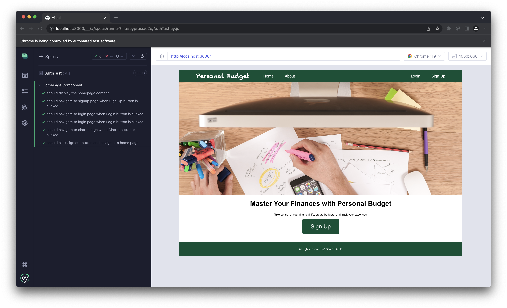

# Budget Management App

Master Your Finances with Personal Budget.

## Table of Contents

- [Project Name](#project-name)
  - [Table of Contents](#table-of-contents)
  - [Description](#description)
  - [Features](#features)
  - [Testing](#testing)
  - [Usage](#usage)
  - [Contact](#contact)

## Description

Welcome to Personal Budget, your all-in-one personal finance management app. With Personal Budget, you can take control of your finances, create and manage budgets, and track your expenses efficiently.

## Features

Create New Budgets: Define budgets for different aspects of your life, such as groceries, entertainment, travel, and more. Be in charge of your spending and saving goals.
Add Items to Budgets: Easily add and categorize expenses within each budget to monitor your spending. Stay organized and make informed financial decisions.
Track Your Expenses: Keep a close eye on your financial activities with detailed insights and reports. Personal Budget helps you stay on top of your financial health.
User-Friendly Interface: Our app is designed with simplicity and user-friendliness in mind. No more financial jargon; we provide an intuitive experience for users of all levels.

## Testing

#### Visual Regression Testing with Applitools 

#### End-to-End Testing with Cypress

#### Unit Testing with Jest

## Usage
Some important things to know about Personal Budget:
- Please be sure to enter a valid email address because you will need to verify your email address to use the app.
- You can add or delete budgets in dashboard while you can only view the budgets in the charts page.
- You can create a new budget by clicking on the "Create New Budget" button on the home page.
- You can add items to your budget by clicking on the cards on the dashboard.

## Contact
For any inquiries or feedback, feel free to reach out:

- **Email:** gavula@uncc.edu
- **Twitter:** [@avulagaurav](https://twitter.com/avulagaurav) 
- **LinkedIn:** [Gaurav Avula](https://www.linkedin.com/in/gauravavula/) 

